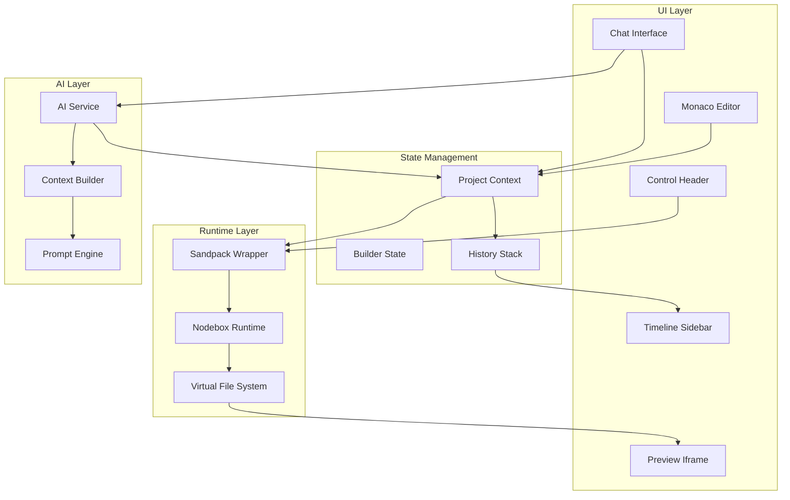

# Design Document: AI Builder IDE

## Overview

The AI Builder IDE is a browser-based development environment that combines AI-powered code generation with live preview capabilities. The system architecture consists of three main layers: the UI layer (React components), the runtime layer (Sandpack/Nodebox), and the AI integration layer (Claude/Gemini API). The design emphasizes real-time synchronization between code changes and preview updates, intelligent context management for AI interactions, and a robust checkpoint system for project history.

## Architecture

### High-Level Architecture



### Component Hierarchy

```
App
├── BuilderProvider (Context)
│   ├── Header
│   │   ├── ModeToggle
│   │   ├── ServerControls
│   │   ├── LibrarySettings
│   │   └── DeployButton
│   ├── ChatMode
│   │   └── ChatInterface
│   │       ├── MessageList
│   │       ├── ChatInput (with @ mentions)
│   │       └── ContextPicker
│   └── BuilderMode
│       ├── ChatPanel (condensed)
│       ├── EditorPanel
│       │   ├── FileTree
│       │   ├── MonacoEditor
│       │   └── TabBar
│       ├── PreviewPanel
│       │   ├── SandpackWrapper
│       │   ├── ErrorOverlay
│       │   └── QRCodeButton
│       └── TimelineSidebar
│           ├── CheckpointList
│           └── DiffViewer
```

## Components and Interfaces

### 1. SandpackWrapper Component

**Purpose:** Manages the Sandpack runtime and provides template-specific configuration.

**Props:**
```typescript
interface SandpackWrapperProps {
  template: 'vite-react' | 'nextjs' | 'node' | 'static';
  files: Record<string, string>;
  onFilesChange: (files: Record<string, string>) => void;
  onConsoleOutput: (logs: ConsoleLog[]) => void;
  onError: (error: RuntimeError) => void;
}
```

**Key Methods:**
- `startServer()`: Boots the WebContainer
- `stopServer()`: Terminates the running process
- `restartServer()`: Performs a hard reload
- `getServerStatus()`: Returns current status (running/booting/stopped)

**Template Configuration:**
```typescript
const TEMPLATE_CONFIGS = {
  'vite-react': {
    entry: '/src/main.tsx',
    dependencies: { react: '^18.0.0', 'react-dom': '^18.0.0' },
    devDependencies: { vite: '^5.0.0', '@vitejs/plugin-react': '^4.0.0' }
  },
  'nextjs': {
    entry: '/app/page.tsx',
    dependencies: { next: '^14.0.0', react: '^18.0.0', 'react-dom': '^18.0.0' },
    structure: ['/app/layout.tsx', '/app/page.tsx']
  },
  'node': {
    entry: '/index.js',
    dependencies: {},
    runtime: 'node'
  },
  'static': {
    entry: '/index.html',
    dependencies: {},
    runtime: 'static'
  }
};
```

### 2. ProjectContext

**Purpose:** Central state management for the entire project.

**State Shape:**
```typescript
interface ProjectState {
  files: Record<string, string>;
  activeFile: string | null;
  template: TemplateType;
  serverStatus: 'stopped' | 'booting' | 'running';
  historyStack: Checkpoint[];
  currentCheckpointIndex: number;
  libraryPreference: LibraryType;
  consoleOutput: ConsoleLog[];
}

interface Checkpoint {
  id: string;
  timestamp: number;
  label: string;
  files: Record<string, string>;
  description?: string;
}
```

**Actions:**
```typescript
interface ProjectActions {
  updateFile: (path: string, content: string) => void;
  createFile: (path: string, content: string) => void;
  deleteFile: (path: string) => void;
  setActiveFile: (path: string) => void;
  createCheckpoint: (label: string) => void;
  restoreCheckpoint: (checkpointId: string) => void;
  setLibraryPreference: (library: LibraryType) => void;
  updateServerStatus: (status: ServerStatus) => void;
}
```

### 3. ChatInterface Component

**Purpose:** Handles AI conversation and context mentions.

**Features:**
- Message streaming with token-by-token display
- Context mention autocomplete (@Files, @Terminal, @Docs)
- Message history persistence
- File attachment preview

**Context Mention System:**
```typescript
interface ContextMention {
  type: 'files' | 'terminal' | 'docs';
  data: any;
}

interface ChatMessage {
  id: string;
  role: 'user' | 'assistant';
  content: string;
  mentions: ContextMention[];
  timestamp: number;
}
```

**Mention Handlers:**
```typescript
class MentionHandler {
  async handleFilesMention(selectedFiles: string[]): Promise<ContextMention> {
    const fileContents = await Promise.all(
      selectedFiles.map(path => readFile(path))
    );
    return {
      type: 'files',
      data: fileContents.map((content, i) => ({
        path: selectedFiles[i],
        content
      }))
    };
  }
  
  async handleTerminalMention(): Promise<ContextMention> {
    const logs = getConsoleOutput().slice(-50);
    return {
      type: 'terminal',
      data: { logs }
    };
  }
  
  async handleDocsMention(query: string): Promise<ContextMention> {
    const docs = await fetchDocumentation(query);
    return {
      type: 'docs',
      data: { query, content: docs }
    };
  }
}
```

### 4. MonacoEditor Integration

**Purpose:** Provides professional code editing capabilities.

**Configuration:**
```typescript
interface EditorConfig {
  language: string;
  theme: 'vs-dark' | 'vs-light';
  options: {
    minimap: { enabled: boolean };
    fontSize: number;
    tabSize: number;
    automaticLayout: boolean;
    formatOnPaste: boolean;
    formatOnType: boolean;
  };
}
```

**File Type Detection:**
```typescript
function getLanguageFromPath(path: string): string {
  const ext = path.split('.').pop();
  const languageMap: Record<string, string> = {
    'ts': 'typescript',
    'tsx': 'typescript',
    'js': 'javascript',
    'jsx': 'javascript',
    'css': 'css',
    'html': 'html',
    'json': 'json',
    'md': 'markdown'
  };
  return languageMap[ext] || 'plaintext';
}
```

### 5. Timeline and Checkpoint System

**Purpose:** Manages project history and enables time-travel debugging.

**Checkpoint Creation Strategy:**
```typescript
class CheckpointManager {
  private historyStack: Checkpoint[] = [];
  private maxCheckpoints = 50;
  
  createCheckpoint(files: Record<string, string>, label: string): void {
    const checkpoint: Checkpoint = {
      id: generateId(),
      timestamp: Date.now(),
      label,
      files: deepClone(files),
      description: this.generateDescription(files)
    };
    
    this.historyStack.push(checkpoint);
    
    // Limit history size
    if (this.historyStack.length > this.maxCheckpoints) {
      this.historyStack.shift();
    }
  }
  
  private generateDescription(files: Record<string, string>): string {
    const fileCount = Object.keys(files).length;
    const changedFiles = this.getChangedFiles(files);
    return `${fileCount} files, ${changedFiles.length} changed`;
  }
}
```

**Diff Calculation:**
```typescript
interface FileDiff {
  path: string;
  type: 'added' | 'modified' | 'deleted';
  oldContent?: string;
  newContent?: string;
  hunks: DiffHunk[];
}

interface DiffHunk {
  oldStart: number;
  oldLines: number;
  newStart: number;
  newLines: number;
  lines: DiffLine[];
}

interface DiffLine {
  type: 'add' | 'delete' | 'context';
  content: string;
  lineNumber: number;
}

function calculateDiff(
  oldFiles: Record<string, string>,
  newFiles: Record<string, string>
): FileDiff[] {
  // Implementation uses diff library (e.g., diff-match-patch)
  // Returns structured diff for visual display
}
```

### 6. Self-Healing Error Detection

**Purpose:** Automatically detects and offers fixes for runtime errors.

**Error Detection:**
```typescript
interface RuntimeError {
  type: 'fatal' | 'warning' | 'info';
  message: string;
  stack?: string;
  file?: string;
  line?: number;
  column?: number;
}

class ErrorDetector {
  private errorListeners: Set<(error: RuntimeError) => void> = new Set();
  
  monitorConsole(sandpackClient: SandpackClient): void {
    sandpackClient.listen((message) => {
      if (message.type === 'console' && message.level === 'error') {
        const error = this.parseError(message);
        if (error.type === 'fatal') {
          this.notifyListeners(error);
        }
      }
    });
  }
  
  private parseError(message: ConsoleMessage): RuntimeError {
    // Parse error message and extract relevant information
    // Classify error severity
    // Extract file location if available
  }
}
```

**Auto-Fix Flow:**
```typescript
class AutoFixService {
  async generateFix(error: RuntimeError, files: Record<string, string>): Promise<string[]> {
    const relevantFile = files[error.file];
    const context = this.buildErrorContext(error, relevantFile);
    
    const prompt = `
      The application crashed with the following error:
      ${error.message}
      
      Stack trace:
      ${error.stack}
      
      Relevant code:
      ${context}
      
      Please provide a fix for this error.
    `;
    
    const response = await aiService.generateCode(prompt);
    return this.parseFixedFiles(response);
  }
}
```

### 7. Asset Generation Service

**Purpose:** Generates placeholder assets when files are missing.

**Implementation:**
```typescript
class AssetGenerator {
  async generatePlaceholder(
    path: string,
    context: string
  ): Promise<string> {
    const fileType = this.getFileType(path);
    
    if (fileType === 'image') {
      return this.generatePlaceholderSVG(path, context);
    } else if (fileType === 'icon') {
      return this.generateIconSVG(path, context);
    }
    
    return '';
  }
  
  private generatePlaceholderSVG(path: string, context: string): string {
    // Use lightweight AI model or template-based generation
    // Generate SVG with appropriate dimensions and content
    const dimensions = this.inferDimensions(context);
    const label = this.inferLabel(path);
    
    return `
      <svg width="${dimensions.width}" height="${dimensions.height}" xmlns="http://www.w3.org/2000/svg">
        <rect width="100%" height="100%" fill="#e0e0e0"/>
        <text x="50%" y="50%" text-anchor="middle" fill="#666">${label}</text>
      </svg>
    `;
  }
}
```

### 8. Library Configuration System

**Purpose:** Manages UI library preferences and auto-configuration.

**Library Configurations:**
```typescript
interface LibraryConfig {
  name: string;
  dependencies: Record<string, string>;
  devDependencies: Record<string, string>;
  fileStructure: FileTemplate[];
  systemPromptAddition: string;
}

const LIBRARY_CONFIGS: Record<LibraryType, LibraryConfig> = {
  'shadcn': {
    name: 'Shadcn UI',
    dependencies: {
      '@radix-ui/react-dialog': '^1.0.0',
      '@radix-ui/react-dropdown-menu': '^2.0.0',
      'class-variance-authority': '^0.7.0',
      'clsx': '^2.0.0',
      'tailwind-merge': '^2.0.0'
    },
    devDependencies: {},
    fileStructure: [
      {
        path: '/src/components/ui/button.tsx',
        template: 'shadcn-button'
      },
      {
        path: '/src/lib/utils.ts',
        template: 'shadcn-utils'
      }
    ],
    systemPromptAddition: 'Use Shadcn UI components. Import from @/components/ui. Use Tailwind for styling.'
  },
  'daisyui': {
    name: 'DaisyUI',
    dependencies: {
      'daisyui': '^4.0.0'
    },
    devDependencies: {},
    fileStructure: [],
    systemPromptAddition: 'Use DaisyUI classes for components. Follow DaisyUI naming conventions.'
  },
  'material-ui': {
    name: 'Material UI',
    dependencies: {
      '@mui/material': '^5.0.0',
      '@emotion/react': '^11.0.0',
      '@emotion/styled': '^11.0.0'
    },
    devDependencies: {},
    fileStructure: [],
    systemPromptAddition: 'Use Material UI components. Import from @mui/material.'
  },
  'tailwind': {
    name: 'Pure Tailwind',
    dependencies: {},
    devDependencies: {
      'tailwindcss': '^3.0.0'
    },
    fileStructure: [],
    systemPromptAddition: 'Use Tailwind CSS utility classes for all styling.'
  }
};
```

### 9. Deployment Service

**Purpose:** Handles one-click deployment to hosting platforms.

**Deployment Flow:**
```typescript
interface DeploymentConfig {
  platform: 'netlify' | 'vercel';
  projectName: string;
  buildCommand: string;
  outputDirectory: string;
}

class DeploymentService {
  async deploy(
    files: Record<string, string>,
    config: DeploymentConfig
  ): Promise<DeploymentResult> {
    // 1. Prepare deployment package
    const deploymentPackage = await this.preparePackage(files, config);
    
    // 2. Upload to platform
    const uploadResult = await this.uploadToplatform(deploymentPackage, config);
    
    // 3. Trigger build
    const buildResult = await this.triggerBuild(uploadResult.deploymentId, config);
    
    // 4. Wait for completion
    const finalResult = await this.waitForDeployment(buildResult.deploymentId);
    
    return {
      url: finalResult.url,
      status: finalResult.status,
      logs: finalResult.logs
    };
  }
  
  private async preparePackage(
    files: Record<string, string>,
    config: DeploymentConfig
  ): Promise<Blob> {
    const zip = new JSZip();
    
    // Add all files
    for (const [path, content] of Object.entries(files)) {
      zip.file(path.replace(/^\//, ''), content);
    }
    
    // Add README
    zip.file('README.md', this.generateReadme(config));
    
    return await zip.generateAsync({ type: 'blob' });
  }
}
```

## Data Models

### File System Structure

```typescript
interface VirtualFileSystem {
  files: Map<string, VirtualFile>;
  directories: Map<string, VirtualDirectory>;
}

interface VirtualFile {
  path: string;
  content: string;
  language: string;
  lastModified: number;
  size: number;
}

interface VirtualDirectory {
  path: string;
  children: string[];
  parent: string | null;
}
```

### Chat Message Model

```typescript
interface ChatMessage {
  id: string;
  role: 'user' | 'assistant' | 'system';
  content: string;
  mentions: ContextMention[];
  timestamp: number;
  metadata?: {
    model?: string;
    tokens?: number;
    duration?: number;
  };
}

interface ChatThread {
  id: string;
  messages: ChatMessage[];
  projectId: string;
  createdAt: number;
  updatedAt: number;
}
```

### Server Status Model

```typescript
type ServerStatus = 'stopped' | 'booting' | 'running' | 'error';

interface ServerState {
  status: ServerStatus;
  port?: number;
  url?: string;
  startTime?: number;
  error?: RuntimeError;
}
```

## Correctness Properties

*A property is a characteristic or behavior that should hold true across all valid executions of a system—essentially, a formal statement about what the system should do. Properties serve as the bridge between human-readable specifications and machine-verifiable correctness guarantees.*


### Property Reflection

After analyzing all acceptance criteria, I've identified several areas of redundancy:

1. **Template Initialization (1.1-1.4)**: These four criteria all test the same behavior - that selecting a template correctly initializes the Sandpack wrapper. These can be combined into one property that tests all template types.

2. **Context Mention Data Preservation (5.3, 6.2, 7.3)**: These three criteria all test that data is correctly included in AI context. They can be combined into one property about context data preservation.

3. **Checkpoint Restoration (3.3, 4.3)**: These are identical - both test that restoring a checkpoint returns the correct file state. One property covers both.

4. **UI Consistency Properties (2.4, 8.2, 10.2, 10.3, 10.5)**: Multiple criteria test that UI renders correctly based on state. These can be consolidated into fewer properties about UI-state consistency.

5. **File System Operations (18.1, 18.2, 18.3)**: These test basic CRUD operations. They can be combined into properties about file system state transitions.

After reflection, I've reduced the properties from 60+ potential tests to 25 core properties that provide comprehensive coverage without redundancy.

### Correctness Properties

**Property 1: Template Initialization Correctness**
*For any* template type (vite-react, nextjs, node, static), when a user selects that template, the Sandpack wrapper should initialize with the correct template configuration including appropriate dependencies and file structure.
**Validates: Requirements 1.1, 1.2, 1.3, 1.4**

**Property 2: Server State Transitions**
*For any* valid server state transition (stopped→booting→running, running→stopped, running→booting→running for restart), the system should correctly update the server status and the status indicator should reflect the new state.
**Validates: Requirements 2.1, 2.2, 2.3, 2.4**

**Property 3: Checkpoint Creation on File Batch Completion**
*For any* file batch completion event, the system should create a checkpoint that contains a complete snapshot of all files, and the history stack length should increase by one.
**Validates: Requirements 3.1**

**Property 4: Timeline Chronological Ordering**
*For any* history stack with multiple checkpoints, the timeline display should show all checkpoints sorted by timestamp in ascending chronological order.
**Validates: Requirements 3.2**

**Property 5: Checkpoint Restoration Round-Trip**
*For any* checkpoint in the history stack, restoring that checkpoint should result in a file system state that exactly matches the snapshot stored in that checkpoint.
**Validates: Requirements 3.3, 4.3**

**Property 6: Timeline Update on Checkpoint Creation**
*For any* checkpoint creation, the timeline UI should update to include the new checkpoint with its timestamp and label within the rendered output.
**Validates: Requirements 3.5**

**Property 7: Diff Calculation Completeness**
*For any* two file system states, the diff calculation should identify all files that differ between the states (added, modified, or deleted) with no files omitted.
**Validates: Requirements 4.1, 4.5**

**Property 8: Diff Visual Formatting**
*For any* calculated diff, the rendered diff view should highlight all additions in green and all deletions in red.
**Validates: Requirements 4.2**

**Property 9: Rollback Cancellation Idempotence**
*For any* file system state, canceling a rollback operation should leave the file system in exactly the same state as before the rollback was initiated.
**Validates: Requirements 4.4**

**Property 10: File Selection Content Completeness**
*For any* set of files selected via @Files mention, the system should read and include the complete content of every selected file with no truncation or omission.
**Validates: Requirements 5.2, 5.3**

**Property 11: File Picker Display Completeness**
*For any* project file system state, the file picker should display all files and directories that exist in the virtual file system.
**Validates: Requirements 5.4**

**Property 12: Multiple File Selection Support**
*For any* @Files mention with multiple file selections, all selected files should be included in the context with their complete contents.
**Validates: Requirements 5.5**

**Property 13: Terminal Capture Line Limit**
*For any* console output with N lines, the @Terminal mention should capture exactly min(N, 50) lines from the end of the output.
**Validates: Requirements 6.1**

**Property 14: Context Data Preservation**
*For any* context mention (@Files, @Terminal, @Docs), when the chat message is sent, the AI context should contain all the data captured by that mention with no loss or corruption.
**Validates: Requirements 5.3, 6.2, 7.3**

**Property 15: ANSI Code Preservation**
*For any* terminal output containing ANSI color codes, the captured output should preserve all ANSI codes exactly as they appeared in the original output.
**Validates: Requirements 6.3**

**Property 16: Terminal Stream Completeness**
*For any* console output, the terminal capture should include lines from both stdout and stderr streams.
**Validates: Requirements 6.5**

**Property 17: Documentation Fetch Integration**
*For any* valid library name specified in @Docs mention, the system should attempt to fetch documentation and include any retrieved content in the AI context.
**Validates: Requirements 7.2, 7.3**

**Property 18: Error Capture Completeness**
*For any* fatal error in the Sandpack console, the system should capture both the error message and the complete stack trace.
**Validates: Requirements 8.1**

**Property 19: Error Detection UI Consistency**
*For any* detected fatal error state, the UI should display a "Fix Error" button over the preview window.
**Validates: Requirements 8.2**

**Property 20: Error Fix Request Data**
*For any* "Fix Error" action, the system should send both the complete error information and the relevant source code to the AI service.
**Validates: Requirements 8.3**

**Property 21: Missing Asset Detection and Generation**
*For any* missing image file reference detected in the preview, the system should generate a placeholder SVG and write it to the virtual file system at the correct path.
**Validates: Requirements 9.1, 9.2, 9.3**

**Property 22: Mode Toggle State Transition**
*For any* current mode (Chat or Builder), clicking the mode toggle should switch to the opposite mode.
**Validates: Requirements 10.1**

**Property 23: Mode Switch Project State Invariant**
*For any* project state (files, checkpoints, chat history), switching between Chat Mode and Builder Mode should preserve all project data without modification.
**Validates: Requirements 10.4**

**Property 24: Library Preference System Prompt Update**
*For any* library preference selection, the system should update the AI system prompt to include the library-specific instructions from the library configuration.
**Validates: Requirements 11.2**

**Property 25: Shadcn Auto-Configuration**
*For any* project where Shadcn UI is selected as the library preference, when the AI generates components, the system should automatically add radix-ui dependencies and create the components/ui directory structure.
**Validates: Requirements 11.3, 11.4**

**Property 26: Library Preference Persistence Round-Trip**
*For any* library preference selection, after storing it in browser storage and reloading the page, the retrieved preference should match the originally selected value.
**Validates: Requirements 11.5**

**Property 27: QR Code URL Encoding Round-Trip**
*For any* Sandpack bundler URL, generating a QR code and then decoding it should return the exact original URL.
**Validates: Requirements 12.1, 12.2**

**Property 28: Export Zip File Completeness**
*For any* virtual file system state, the exported zip file should contain all source files, a package.json with all dependencies, and an auto-generated README.md.
**Validates: Requirements 13.1, 13.2, 13.3**

**Property 29: Export Zip Structure Preservation**
*For any* virtual file system with nested directories, the exported zip should preserve the complete directory structure and file paths.
**Validates: Requirements 13.4**

**Property 30: Deployment Data Serialization Round-Trip**
*For any* file system state, serializing to JSON for deployment and then deserializing should produce an equivalent file system state.
**Validates: Requirements 14.1**

**Property 31: Deployment Request Format**
*For any* deployment request, the POST data should include all required fields (files, project name, build command, output directory) in the correct format.
**Validates: Requirements 14.2**

**Property 32: Deployment Response URL Display**
*For any* successful deployment response containing a URL, the system should display that URL to the user.
**Validates: Requirements 14.4**

**Property 33: File Modification Triggers HMR**
*For any* file modification in the virtual file system, the Sandpack runtime should trigger an HMR update to the preview iframe.
**Validates: Requirements 16.1**

**Property 34: HMR Failure Fallback**
*For any* HMR update failure, the system should perform a full reload of the preview iframe.
**Validates: Requirements 16.3**

**Property 35: Message Display Immediacy**
*For any* user message sent in the chat interface, that message should appear in the chat history immediately (synchronously) after sending.
**Validates: Requirements 17.2**

**Property 36: Chat History Persistence Round-Trip**
*For any* chat history state, storing it in browser storage and then retrieving it after a page refresh should return an equivalent chat history.
**Validates: Requirements 17.5**

**Property 37: File Creation State Consistency**
*For any* new file created by the AI, both the virtual file system and the file tree UI should be updated to include the new file.
**Validates: Requirements 18.1**

**Property 38: File Modification State Update**
*For any* file modification operation, the content stored in the virtual file system should match the new content provided.
**Validates: Requirements 18.2**

**Property 39: File Deletion State Consistency**
*For any* file deletion operation, the file should be removed from both the virtual file system and the file tree UI.
**Validates: Requirements 18.3**

**Property 40: File Tree Display Completeness**
*For any* virtual file system state, the file tree UI should display all files and directories that exist in the file system.
**Validates: Requirements 18.4**

**Property 41: Deep Directory Nesting Support**
*For any* directory structure up to 10 levels deep, the system should correctly store, retrieve, and display all files at all nesting levels.
**Validates: Requirements 18.5**

## Error Handling

### Error Categories

1. **Runtime Errors**: Errors that occur during code execution in the Sandpack environment
2. **Network Errors**: Failures in API calls to AI services or deployment platforms
3. **File System Errors**: Issues with file operations in the virtual file system
4. **State Errors**: Inconsistencies in application state
5. **User Input Errors**: Invalid or malformed user input

### Error Handling Strategies

**Runtime Errors:**
```typescript
class RuntimeErrorHandler {
  handleError(error: RuntimeError): void {
    // Log error for debugging
    logger.error('Runtime error', { error });
    
    // Display error overlay
    this.showErrorOverlay(error);
    
    // Offer auto-fix if applicable
    if (this.isAutoFixable(error)) {
      this.showAutoFixButton(error);
    }
    
    // Update server status
    this.updateServerStatus('error');
  }
  
  private isAutoFixable(error: RuntimeError): boolean {
    // Syntax errors, undefined variables, import errors are auto-fixable
    const fixableTypes = ['SyntaxError', 'ReferenceError', 'ImportError'];
    return fixableTypes.some(type => error.message.includes(type));
  }
}
```

**Network Errors:**
```typescript
class NetworkErrorHandler {
  async handleAPIError(error: APIError): Promise<void> {
    if (error.status === 429) {
      // Rate limit - show retry with backoff
      await this.retryWithBackoff(error.request);
    } else if (error.status >= 500) {
      // Server error - show error message and retry option
      this.showRetryDialog(error);
    } else if (error.status === 401) {
      // Auth error - redirect to login
      this.redirectToAuth();
    } else {
      // Other errors - show generic error message
      this.showErrorToast(error.message);
    }
  }
  
  private async retryWithBackoff(
    request: () => Promise<any>,
    maxRetries: number = 3
  ): Promise<any> {
    for (let i = 0; i < maxRetries; i++) {
      try {
        return await request();
      } catch (error) {
        if (i === maxRetries - 1) throw error;
        await this.delay(Math.pow(2, i) * 1000);
      }
    }
  }
}
```

**File System Errors:**
```typescript
class FileSystemErrorHandler {
  handleFileError(error: FileSystemError): void {
    switch (error.type) {
      case 'FILE_NOT_FOUND':
        // Attempt to regenerate or show error
        this.handleMissingFile(error.path);
        break;
      case 'INVALID_PATH':
        // Show validation error
        this.showValidationError('Invalid file path');
        break;
      case 'PERMISSION_DENIED':
        // Show permission error
        this.showPermissionError();
        break;
      default:
        // Generic file system error
        this.showGenericError(error);
    }
  }
  
  private handleMissingFile(path: string): void {
    if (this.isAssetFile(path)) {
      // Trigger asset generation
      assetGenerator.generatePlaceholder(path);
    } else {
      // Show file not found error
      this.showFileNotFoundError(path);
    }
  }
}
```

**State Errors:**
```typescript
class StateErrorHandler {
  handleStateInconsistency(error: StateError): void {
    // Log the inconsistency
    logger.error('State inconsistency detected', { error });
    
    // Attempt to recover
    if (this.canRecover(error)) {
      this.recoverState(error);
    } else {
      // Show error and offer to reset
      this.showResetDialog(error);
    }
  }
  
  private recoverState(error: StateError): void {
    // Restore from last known good checkpoint
    const lastCheckpoint = this.getLastValidCheckpoint();
    if (lastCheckpoint) {
      this.restoreCheckpoint(lastCheckpoint);
    }
  }
}
```

### Error Recovery Mechanisms

1. **Automatic Retry**: For transient network errors
2. **State Restoration**: Rollback to last valid checkpoint
3. **Graceful Degradation**: Continue with reduced functionality
4. **User Notification**: Clear error messages with actionable steps
5. **Error Logging**: Comprehensive logging for debugging

## Testing Strategy

### Dual Testing Approach

The AI Builder IDE will employ both unit testing and property-based testing to ensure comprehensive coverage and correctness.

**Unit Tests** focus on:
- Specific examples of correct behavior
- Edge cases (empty files, deeply nested directories, special characters)
- Error conditions (network failures, invalid input, missing files)
- Integration points between components
- UI interactions and state transitions

**Property-Based Tests** focus on:
- Universal properties that hold for all inputs
- Data integrity across transformations
- State consistency across operations
- Round-trip properties (serialization, checkpoints, QR codes)
- Invariants that must be maintained

### Property-Based Testing Configuration

**Testing Library**: We will use **fast-check** for JavaScript/TypeScript property-based testing.

**Configuration**:
- Minimum 100 iterations per property test
- Each test tagged with feature name and property number
- Tag format: `Feature: ai-builder-ide, Property N: [property description]`

**Example Property Test Structure**:
```typescript
import fc from 'fast-check';

describe('AI Builder IDE Properties', () => {
  // Feature: ai-builder-ide, Property 1: Template Initialization Correctness
  it('should initialize Sandpack with correct template configuration', () => {
    fc.assert(
      fc.property(
        fc.constantFrom('vite-react', 'nextjs', 'node', 'static'),
        (template) => {
          const wrapper = new SandpackWrapper({ template });
          const config = wrapper.getConfiguration();
          
          // Verify correct template is set
          expect(config.template).toBe(template);
          
          // Verify template-specific configuration
          const expectedConfig = TEMPLATE_CONFIGS[template];
          expect(config.dependencies).toEqual(expectedConfig.dependencies);
          expect(config.entry).toBe(expectedConfig.entry);
        }
      ),
      { numRuns: 100 }
    );
  });
  
  // Feature: ai-builder-ide, Property 5: Checkpoint Restoration Round-Trip
  it('should restore exact file state from checkpoint', () => {
    fc.assert(
      fc.property(
        fc.dictionary(fc.string(), fc.string()),
        (files) => {
          const manager = new CheckpointManager();
          
          // Create checkpoint
          manager.createCheckpoint(files, 'test');
          const checkpoint = manager.getLatestCheckpoint();
          
          // Restore checkpoint
          const restoredFiles = manager.restoreCheckpoint(checkpoint.id);
          
          // Verify exact match
          expect(restoredFiles).toEqual(files);
        }
      ),
      { numRuns: 100 }
    );
  });
  
  // Feature: ai-builder-ide, Property 13: Terminal Capture Line Limit
  it('should capture exactly min(N, 50) lines from console', () => {
    fc.assert(
      fc.property(
        fc.array(fc.string(), { minLength: 0, maxLength: 200 }),
        (consoleLines) => {
          const handler = new MentionHandler();
          const captured = handler.handleTerminalMention(consoleLines);
          
          const expectedCount = Math.min(consoleLines.length, 50);
          expect(captured.data.logs).toHaveLength(expectedCount);
          
          // Verify we got the last N lines
          if (consoleLines.length > 0) {
            const expectedLines = consoleLines.slice(-expectedCount);
            expect(captured.data.logs).toEqual(expectedLines);
          }
        }
      ),
      { numRuns: 100 }
    );
  });
});
```

### Unit Testing Strategy

**Test Organization**:
- Co-locate tests with source files using `.test.ts` suffix
- Group related tests using `describe` blocks
- Use descriptive test names that explain the scenario

**Example Unit Tests**:
```typescript
describe('SandpackWrapper', () => {
  describe('Server Controls', () => {
    it('should transition from stopped to running when start is clicked', async () => {
      const wrapper = new SandpackWrapper({ template: 'vite-react' });
      
      expect(wrapper.getServerStatus()).toBe('stopped');
      
      await wrapper.startServer();
      
      expect(wrapper.getServerStatus()).toBe('running');
    });
    
    it('should handle start failure gracefully', async () => {
      const wrapper = new SandpackWrapper({ template: 'vite-react' });
      
      // Simulate start failure
      jest.spyOn(wrapper, 'bootWebContainer').mockRejectedValue(new Error('Boot failed'));
      
      await expect(wrapper.startServer()).rejects.toThrow('Boot failed');
      expect(wrapper.getServerStatus()).toBe('error');
    });
  });
  
  describe('File Operations', () => {
    it('should create a new file in the virtual file system', () => {
      const wrapper = new SandpackWrapper({ template: 'vite-react' });
      
      wrapper.createFile('/src/test.ts', 'console.log("test");');
      
      expect(wrapper.getFile('/src/test.ts')).toBe('console.log("test");');
    });
    
    it('should handle deeply nested directory creation', () => {
      const wrapper = new SandpackWrapper({ template: 'vite-react' });
      
      const deepPath = '/a/b/c/d/e/f/g/h/i/j/file.ts';
      wrapper.createFile(deepPath, 'content');
      
      expect(wrapper.getFile(deepPath)).toBe('content');
    });
  });
});

describe('CheckpointManager', () => {
  it('should create checkpoint with correct timestamp', () => {
    const manager = new CheckpointManager();
    const beforeTime = Date.now();
    
    manager.createCheckpoint({ 'file.ts': 'content' }, 'test');
    
    const afterTime = Date.now();
    const checkpoint = manager.getLatestCheckpoint();
    
    expect(checkpoint.timestamp).toBeGreaterThanOrEqual(beforeTime);
    expect(checkpoint.timestamp).toBeLessThanOrEqual(afterTime);
  });
  
  it('should limit history stack to max checkpoints', () => {
    const manager = new CheckpointManager();
    
    // Create 60 checkpoints (max is 50)
    for (let i = 0; i < 60; i++) {
      manager.createCheckpoint({ [`file${i}.ts`]: 'content' }, `checkpoint ${i}`);
    }
    
    expect(manager.getCheckpointCount()).toBe(50);
  });
});

describe('MentionHandler', () => {
  it('should handle @Files mention with empty selection', async () => {
    const handler = new MentionHandler();
    
    const result = await handler.handleFilesMention([]);
    
    expect(result.data).toEqual([]);
  });
  
  it('should handle @Terminal mention with empty console', async () => {
    const handler = new MentionHandler();
    
    const result = await handler.handleTerminalMention([]);
    
    expect(result.data.logs).toEqual([]);
  });
  
  it('should handle @Docs mention when documentation not found', async () => {
    const handler = new MentionHandler();
    
    // Mock fetch to return 404
    jest.spyOn(global, 'fetch').mockResolvedValue({
      ok: false,
      status: 404
    } as Response);
    
    const result = await handler.handleDocsMention('nonexistent-library');
    
    expect(result.data.content).toBeNull();
  });
});
```

### Integration Testing

**Key Integration Points**:
1. Sandpack ↔ Monaco Editor synchronization
2. AI Service ↔ File System updates
3. Checkpoint System ↔ Timeline UI
4. Error Detection ↔ Auto-Fix Flow
5. Export ↔ Deployment Pipeline

**Example Integration Test**:
```typescript
describe('AI to File System Integration', () => {
  it('should update file system and editor when AI generates code', async () => {
    const { wrapper, editor, aiService } = setupIntegrationTest();
    
    // Simulate AI generating code
    const generatedCode = 'export const hello = () => "world";';
    await aiService.generateCode('create a hello function');
    
    // Verify file system updated
    expect(wrapper.getFile('/src/hello.ts')).toBe(generatedCode);
    
    // Verify editor updated
    expect(editor.getValue()).toBe(generatedCode);
    
    // Verify preview updated
    await waitForPreviewUpdate();
    expect(wrapper.getServerStatus()).toBe('running');
  });
});
```

### Test Coverage Goals

- **Unit Test Coverage**: Minimum 80% code coverage
- **Property Test Coverage**: All 41 correctness properties implemented
- **Integration Test Coverage**: All major integration points tested
- **E2E Test Coverage**: Critical user flows (create project, edit code, deploy)

### Continuous Testing

- Run unit tests on every commit
- Run property tests on every pull request
- Run integration tests nightly
- Run E2E tests before releases

## Implementation Notes

### Performance Considerations

1. **Virtual File System**: Use efficient data structures (Map) for O(1) file lookups
2. **Checkpoint Storage**: Implement checkpoint compression for large projects
3. **Diff Calculation**: Use efficient diff algorithms (Myers' diff) for large files
4. **Preview Updates**: Debounce file changes to avoid excessive HMR triggers
5. **Chat History**: Implement pagination for long conversation histories

### Browser Compatibility

- Target modern browsers (Chrome 90+, Firefox 88+, Safari 14+, Edge 90+)
- Use WebContainer API which requires SharedArrayBuffer support
- Implement fallbacks for browsers without full support
- Test on multiple browsers and devices

### Accessibility

- Ensure keyboard navigation for all features
- Provide ARIA labels for screen readers
- Support high contrast modes
- Ensure sufficient color contrast for diff highlighting
- Provide text alternatives for visual indicators

### Security Considerations

1. **Code Execution**: Sandpack runs in isolated iframe with restricted permissions
2. **API Keys**: Store AI API keys securely, never expose in client code
3. **File Upload**: Validate and sanitize all file uploads
4. **XSS Prevention**: Sanitize all user-generated content before rendering
5. **CORS**: Configure proper CORS policies for deployment endpoints

### Scalability

1. **State Management**: Use React Context with memoization to prevent unnecessary re-renders
2. **File System**: Implement lazy loading for large projects
3. **Chat History**: Implement virtual scrolling for long conversations
4. **Checkpoints**: Implement checkpoint pruning strategy for long sessions
5. **Asset Generation**: Queue and batch asset generation requests

## References

- [Sandpack Documentation](https://sandpack.codesandbox.io/)
- [Monaco Editor API](https://microsoft.github.io/monaco-editor/api/index.html)
- [WebContainer API](https://webcontainers.io/api)
- [fast-check Documentation](https://fast-check.dev/)
- [React Context Best Practices](https://react.dev/learn/passing-data-deeply-with-context)
